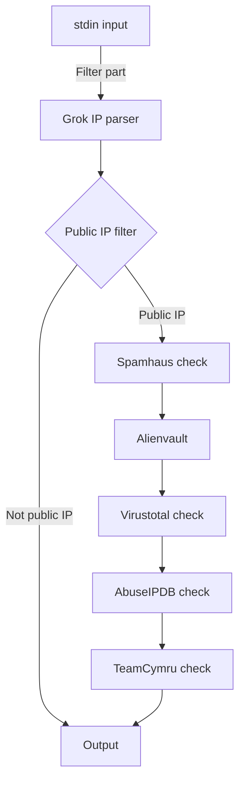

# Описание

Это мой дипломный проект по проверке IP-адресов в различных TI-фидах на базе Logstash  
Для запуска требуется установить `logstash-filter-public_ip` командой

    .\logstash-plugin install logstash-filter-public_ip

в директории bin

Дополнительно требуется установить [`logstash-filter-teamcymru`](https://github.com/summergaga/logstash-filter-teamcymru)
# Структурная схема


# Механизм работы
## Spamhaus
Если DNS-запрос вернул 127.0.0.4 - адрес присутствует в спам-листах Spamhaus. [Коды](https://www.spamhaus.org/zen/) и их [описание](https://www.spamhaus.org/faq/section/DNSBL%20Usage#200).
## Рейтинг Alienvault
Почему-то он везде 0... Но через [API](https://otx.alienvault.com/api) работает.

## Проверка Virustotal
Получаем оценку от Virustotal в интервале [-100, 100], где -100 - "абсолютно вредоносный", а 100 - "абсолютно безвредный". [Подробнее](https://support.virustotal.com/hc/en-us/articles/115002146769-Comments).

## Проверка AbuseIPDB
Интервал оценки - [0, 100]. 0 - безвреден, 100 - вредоносный. [Подробнее](https://www.abuseipdb.com/faq.html#confidence).

## Проверка Teamcymru
Рейтинг от 0 до 100, аналогично AbuseIPDB.

# Примеры вывода
```
1.1.1.1 - Cloudflare DNS one.one.one.one
{
                  "ip" => "1.1.1.1",
     "abuseipdb_score" => 0,
    "virustotal_score" => 69,
    "teamcymru" => 56,
    "alienvault_score" => 0,
}
```
```
104.21.56.234 - rutracker.org
{
                  "ip" => "104.21.56.234",
     "abuseipdb_score" => 0,
    "alienvault_score" => 0,
    "virustotal_score" => 0,
    "teamcymru" => 0,
}
```
```
2606:4700:3036::6815:38ea - rutracker.org IPv6
{
    "abuseipdb_score" => 0,
    "alienvault_score" => 0,
                 "ip" => "2606:4700:3036::6815:38ea"
}
```
```
91.238.229.134 - IP from AS58042
{
    "alienvault_score" => 0,
    "abuseipdb_score" => 100,
    "virustotal_score" => 0,
    "teamcymru" => 17,
                 "ip" => "91.238.229.134"
}
```