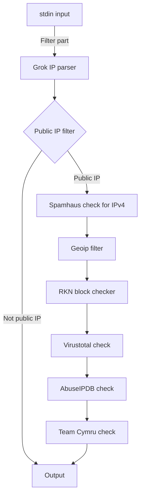

# diplom

This is my diplom project "Logstash-based IP checker"  
Run

    .\logstash-plugin install logstash-filter-virustotalthree logstash-filter-public_ip

in bin directory before using this plugin

Execution order
