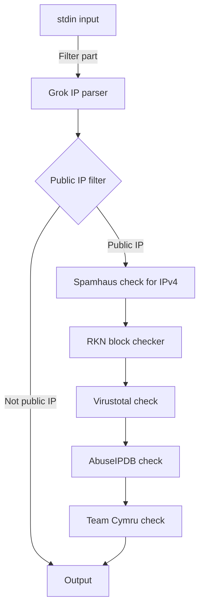

# Описание

Это мой дипломный проект по проверке IP-адресов в различных TI-фидах на базе Logstash  
Для запуска требуется установить `logstash-filter-public_ip` командой

    .\logstash-plugin install logstash-filter-public_ip

в директории bin

Дополнительно требуется установить [`logstash-filter-teamcymru`](https://github.com/summergaga/logstash-filter-teamcymru)
# Структурная схема
